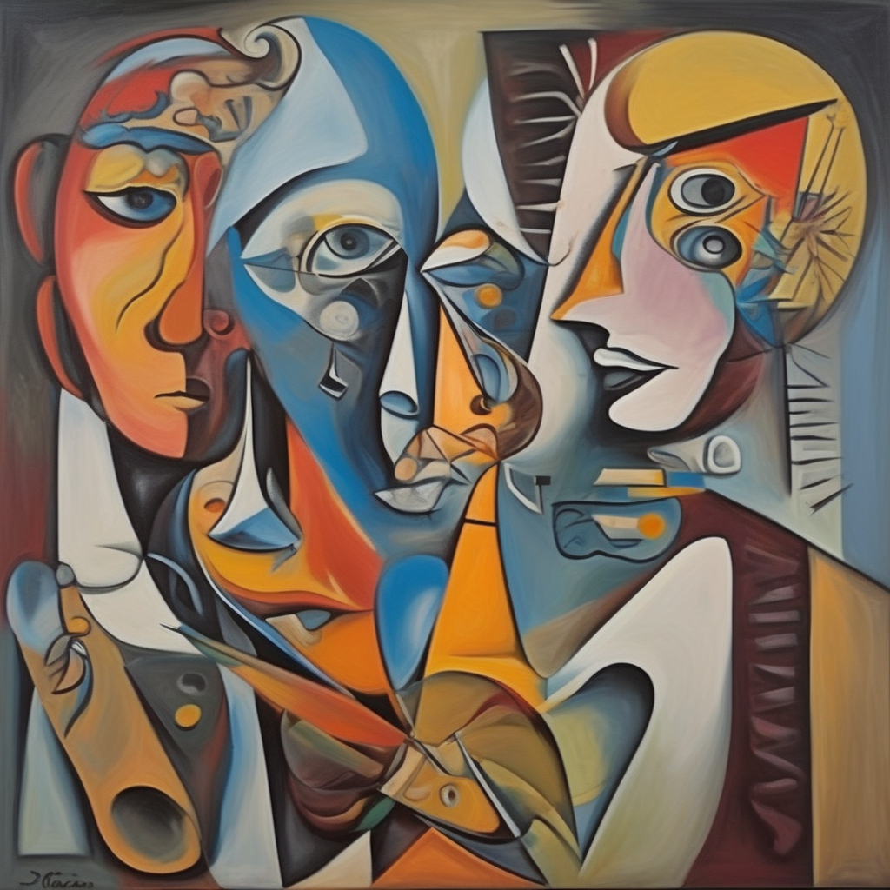

# 🎨 Picasso LoRA Trainer – Fine-Tuning with AI  

This project fine-tunes Stable Diffusion XL using **LoRA** on a small dataset of **Picasso's paintings**. The goal is to teach the model to generate images **in Picasso’s style** with limited training data.

## 📌 About this project  
- **Base model used:** `Stable Diffusion XL (SDXL)`  
- **Dataset:** A selection of Picasso’s paintings  
- **Goal:** Train LoRA to generate images inspired by Picasso’s artistic style 
- **Comparison:** Two sets of 10 generated images with **two different prompts**  

---
## 📸 Generated Images

### 🎨 **Prompt 1: Bold Abstract Colors**
> _"A surrealist painting in the style of Picasso, abstract and colorful"_

  
  
  
  
  
  
  
  
  
  

---

### 🎭 **Prompt 2: Pale Pastel Surrealist Portrait**
> _"A surrealist portrait of a woman in the style of Picasso, with pale pastel colors, abstract shapes, and delicate brush strokes, inspired by Picasso’s Blue Period."_

  
  
  
  
  
  
  
  
  
  

---

## 📂 Project Files
- 📜 **Google Colab Notebook:** [`picasso_lora_trainer_xl.ipynb`](https://github.com/RominaSR/picasso-ai-lora-trainer/blob/main/picasso_lora_trainer_xl.ipynb)  
- 🖼️ **Generated Imagesfolder:** [`generative_picasso`](https://github.com/RominaSR/picasso-ai-lora-trainer/tree/main/generative_picasso)  
- 🧠 **Trained LoRA models:** [`Loras`](https://github.com/RominaSR/picasso-ai-lora-trainer/tree/main/Loras)  

---

## 🔗 References & Credits  
This project was built using:
- [Stable Diffusion XL (SDXL)](https://huggingface.co/stabilityai/stable-diffusion-xl-base-1.0)
- [kohya-ss LoRA Trainer](https://github.com/kohya-ss/sd-scripts)
- [LoRA Easy Training Scripts](https://github.com/derrian-distro/LoRA_Easy_Training_scripts_Backend/)
